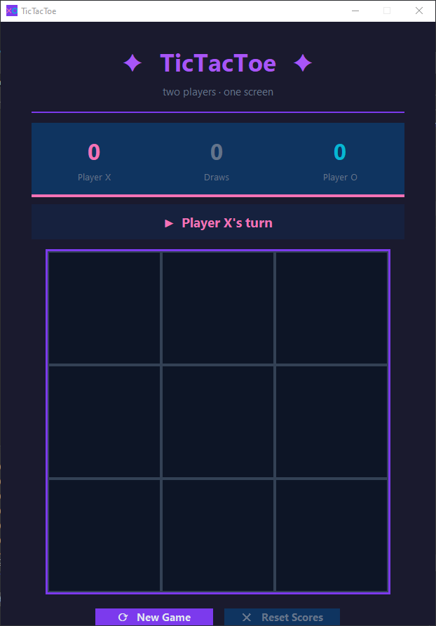

# 🎮 TicTacToe

A modern, animated desktop Tic-Tac-Toe game built with Python and Tkinter. Inspired by the dark UI style of [PyGenPass](https://github.com/theprzemoo/PyGenPass) — featuring smooth animations, purple accents, and a polished two-player experience.

[](https://www.python.org/)
[](https://docs.python.org/3/library/tkinter.html)
[]()
[]()

---

## ✨ Features

- **Animated symbols** – X and O scale up smoothly when placed on the board
- **Hover preview** – see a ghost of your symbol before clicking
- **Win highlight + pulse** – winning cells glow gold and pulse repeatedly
- **Draw animation** – board fades to grey on a tie
- **Slide-in status bar** – current player indicator animates into view
- **Score counter** – animated count-up for X wins, O wins, and draws
- **Fade-in startup** – window fades in on launch
- **Animated buttons** – smooth color interpolation on hover/press
- **Session reset** – reset scores across multiple rounds
- **Zero dependencies** – only Python's built-in `tkinter` required

---

## 📸 GUI Preview



```

**Color coding:**
- 🌸 Pink — Player X
- 🌊 Teal — Player O
- 🟡 Gold — Winning cells (animated pulse)
- 🟣 Purple — Accent / UI chrome

---

## 🚀 Getting Started

### Requirements

- Python 3.10 or newer
- No additional packages — uses only the standard library!

### Run

```bash
python main.py
```

On Windows you can also double-click `run.bat`.

---

## 🕹️ How to Play

1. Launch the app — Player **X** always goes first.
2. Click any empty cell to place your symbol.
3. First to get **3 in a row** (horizontal, vertical, or diagonal) wins!
4. Winning cells will **glow and pulse** in gold.
5. Press **⟳ New Game** to start a fresh round (scores are kept).
6. Press **✕ Reset Scores** to wipe the session scoreboard.

---

## 📁 Project Structure

```
TicTacToe/
├── main.py          # Full application (game logic + UI + animations)
├── run.bat          # Windows one-click launcher
├── README.md        # This file
└── LICENSE          # MIT License
```

---

## 🖼️ Taking a Screenshot

**Windows:** `Win + Shift + S` → select the app window  
**macOS:** `Cmd + Shift + 4` → click-drag over the window  
**Linux:** Use `gnome-screenshot`, `scrot`, or `flameshot`

For a clean portfolio screenshot:
1. Launch the app and play a few moves
2. Let a player win so the golden pulse animation is visible
3. Capture the full window

---

## 🛠️ Built With

- [Python](https://www.python.org/) — core language
- [Tkinter](https://docs.python.org/3/library/tkinter.html) — built-in GUI framework
- Custom `AnimButton` class — smooth interpolated hover animations
- Canvas-based animations — no external animation libraries needed

---

## 📄 License

MIT License — see [LICENSE](LICENSE) for details.
